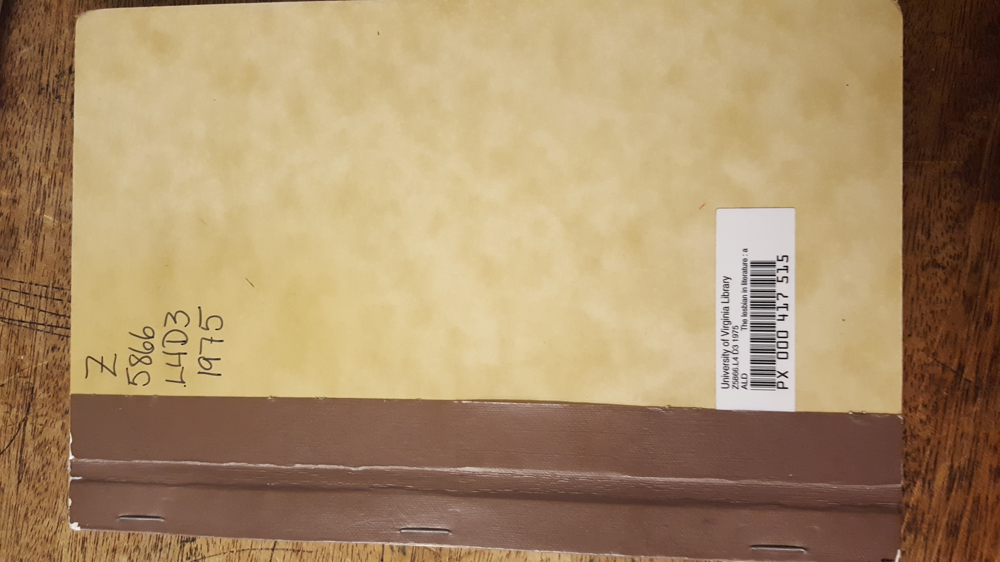

## Linking Internal and External Evidence in Barnes

**Goal**: Find an internal and external connection to Djuna Barnes' _Ladies Almanack_ and a source from Harner.

### Passage

"Most wretchedly never that I have heard of, nor one such Pair seen later in a Bed of Matrimony, tied up, Bosom to Bosom, Braid to Braid, Womb to Womb! But have, ever since the instigation of that Alliance, lain abed out of Wedlock, sinning in a double and similar Sin ; rising unprovided for by Church or Cerificate ; Fornicating in an Evil so exactly of a piece, that the Judgement Call must be answered in a Trembling Tandem !" (Barnes 19)

### Internal Evidence

I think this passage, either spoken by Lady Buck-and-Balk or her friend Tilly Tweed-In-Blood, shows how a romantic relationship between a woman and another woman was so frowned upon because during that time, and even now, many people were used to the traditional relationship between a man and a woman. To think anything else other than that was an abomination. This book reminds me so much of modern day Christians because no matter how long Lesbianism has been around, people still do not accept that love comes in different ways. No one ever said that love was just limited to only a man and a woman.

### External Evidence

I had a bit of trouble with this part. Originally I'd went for the book _Queer Theory_ by Joan Nordquist, as mentioned in Harner's chapter _U. Literature Related Topics and Sources_, but came up short when I noticed it was just a pages upon pages of sources to other LGBTQ books. So I decided to try again with another book, this time _The Lesbian in Literature_ by Gene Damon, Jan Watson and Robin Jordan, only yo have the ** exact same results** . Despite only getting sources to other articles or books, the biggest thing I take from this is that Djuna Barnes is only one of many female authors that create stories with some for of homosexuality in it, especially in such a large portion of it. 

![Inside Cover] (20170129_203314.jpg)
![Random Page] ()
